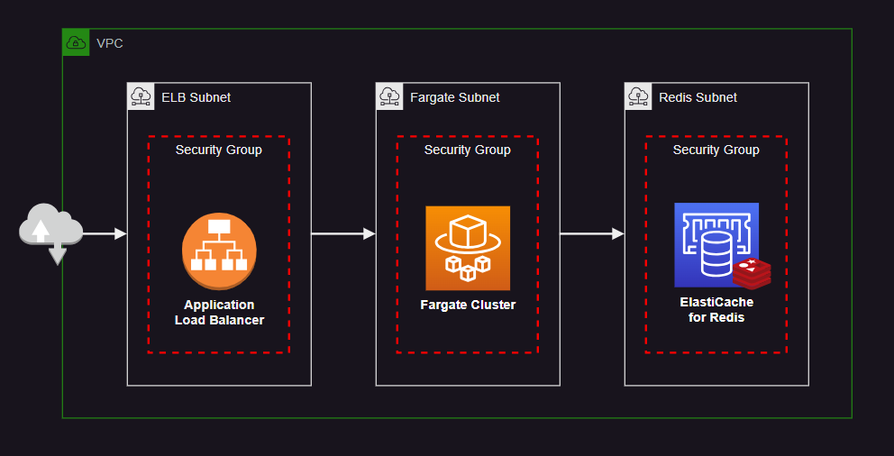

# AWS ECS Fargate + ElastiCache Redis

ElastiCache Redis deployment being accessed by an application running on ECS Fargate:



## Running on AWS

Create the `.auto.tfvars` variables file:

```shell
cp aws/config/local.auto.tfvars aws/.auto.tfvars
```

Apply the resources:

```sh
terraform -chdir="aws" init
terraform -chdir="aws" apply -auto-approve
```

After the deployment, test the enqueue mechanism. Check CW Logs for the results:

```sh
curl -X POST http://lb-supercache-0000000000.us-east-2.elb.amazonaws.com/enqueue
```

The Redis instance is configured with encryption in transit and password authentication.


## Localhost

In order to test the application locally, run a Redis container:

```sh
docker run -d --name redis-local -p 6379:6379 redis
```

In the application directory, create the `.env` file for local development:

```sh
cp template.env .env
```

Run the application:

```sh
npm install
npm run dev
```

Send a test message to the Redis queue:

```sh
curl -X POST localhost/enqueue
```

To test the private key from Secrets Manager:

```sh
curl localhost:3000/privatekey
```

## Secrets Manager

In order to test this, SSM into the EC2 instance.

```sh
aws ssm start-session --target instance-id
```

Check the identity:

```sh
aws sts get-caller-identity
aws configure list-profiles
```

Perform this operation as the root:

```sh
sudo su -
```

Generate an RSA key pair:

```sh
openssl genrsa -out private-key.pem 2048
openssl rsa -in private-key.pem -pubout -out public-key.pem
```

Some services my prefer to use DER format encoding:

```sh
openssl rsa -pubin -inform PEM -in public-key.pem -outform DER -out public-key.der
```

First, check the read access to the secret:

```sh
aws secretsmanager describe-secret --secret-id "supercache/privatekey/xxxxx"
```

Create the secret:

```sh
aws secretsmanager put-secret-value \
  --secret-id "supercache/privatekey/xxxxx" \
  --secret-string file://private-key.pem
```
