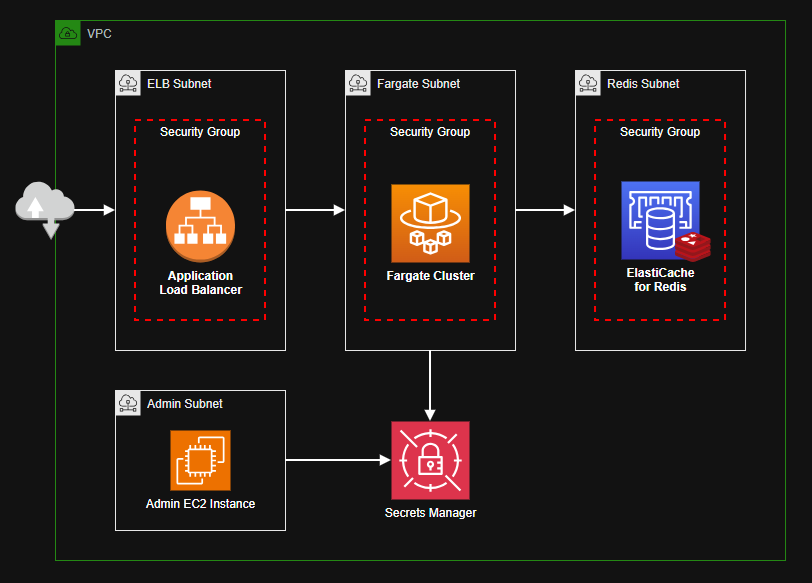

# AWS ECS Fargate + ElastiCache Redis

ElastiCache Redis deployment being accessed by an application running on ECS Fargate:



To apply the infrastructure locally, first create a `.auto.tfvars` file:

```terraform
redis_auth_token = "asd90f87abcxz7c80fsda"
```

Apply the resources:

```sh
terraform -chdir="aws" init
terraform -chdir="aws" apply -auto-approve
```

After the deployment, test the enqueue mechanism. Check CW Logs for the results:

```sh
curl -X POST http://lb-supercache-0000000000.us-east-2.elb.amazonaws.com/enqueue
```

The Redis instance is configured with encryption in transit and password authentication.


## Localhost

In order to test the application locally, run a Redis container:

```sh
docker run -d --name redis-local -p 6379:6379 redis
```

In the application directory, create the `.env` file for local development:

```sh
PORT="3000"
REDIS_HOST="localhost"
REDIS_PORT="6379"
REDIS_CONNECT_TIMEOUT="5000"
REDIS_PASSWORD="yF9kbhovOjKYKURp8lnmPnE9sc3Y9HC9"
REDIS_TLS="0"
```

Run the application:

```
npm install
npm run dev
```

Send a test message to the Redis queue:

```
curl -X POST localhost/enqueue
```
